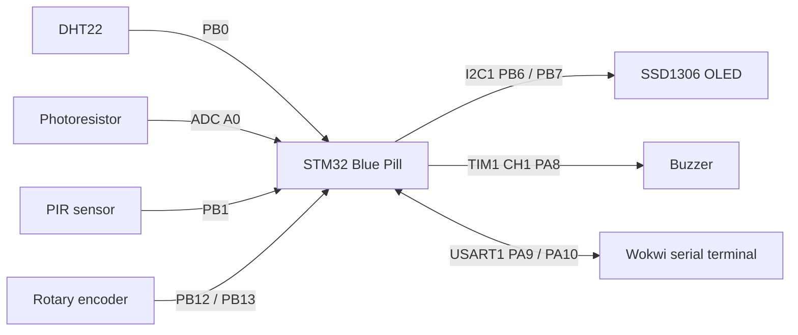
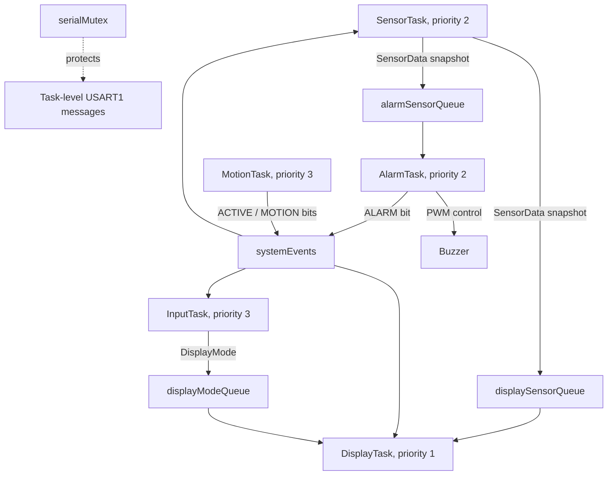
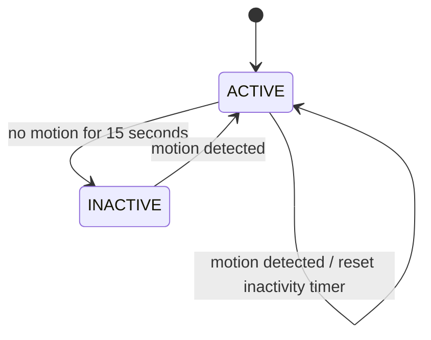

# BCA182 FreeRTOS Multisensor Room Monitor

A simulated room-monitoring system built for the STM32 Blue Pill using PlatformIO, STM32Cube HAL, and native FreeRTOS APIs. It samples environmental inputs, displays one measurement at a time on an SSD1306 OLED, responds to a rotary encoder, and controls a temperature alarm.

## Project Overview

The application divides hardware access and decision-making across FreeRTOS tasks. `SensorTask` publishes snapshots to separate display and alarm queues. `DisplayTask` is the only task that writes to the OLED. `MotionTask` tracks PIR activity and updates the ACTIVE/INACTIVE state. The rotary encoder selects the displayed page, and `AlarmTask` evaluates valid temperature samples and drives the buzzer.

The target is an STM32F103C8T6 Blue Pill simulated in Wokwi. The project uses C/C++, STM32Cube HAL, and FreeRTOS; it does not use the Arduino framework.

## Features

- DHT22 temperature and humidity sampling every 2 seconds.
- LDR relative light level reported as 0-100%, with brighter Wokwi illumination represented by a higher percentage. This is not calibrated lux.
- PIR motion detection and automatic ACTIVE/INACTIVE state transitions after 15 seconds without motion.
- OLED pages for temperature, humidity, light, and motion.
- Rotary encoder navigation with wraparound.
- Temperature alarm below 18 C or above 30 C; the exact boundaries are in the normal range.
- PWM buzzer output on TIM1 channel 1 / PA8.
- FreeRTOS queues, an event group, a mutex-protected serial writer, and periodic `vTaskDelayUntil()` sampling.

## Learning Objectives

This project demonstrates modular embedded firmware, concurrent FreeRTOS task design, task priorities and blocking states, queue-based inter-task communication, shared-resource synchronization, event signaling, state-machine logic, native unit tests, static analysis, and Wokwi functional verification.

## System Architecture

The sensors and controls connect to the Blue Pill through STM32 GPIO, ADC, I2C, timer, and UART peripherals. The application separates acquisition, input, display, alarm, and motion/state responsibilities.



## FreeRTOS Architecture



`SensorTask` publishes the same snapshot to two one-item overwrite queues because a FreeRTOS queue is not a broadcast channel. `DisplayTask` consumes sensor data and the current `DisplayMode`; `AlarmTask` blocks waiting for the next alarm queue item. The event group communicates activity, motion, and alarm state. `Serial_Print()` protects each complete task-level message with `serialMutex`.

## Hardware / Simulated Components

| Component | Role |
| --- | --- |
| STM32 Blue Pill / STM32F103C8T6 | Main controller |
| DHT22 | Temperature and relative humidity |
| Photoresistor / LDR | Relative ambient-light level |
| PIR | Motion detection |
| KY-040 rotary encoder | Page navigation |
| SSD1306 OLED | Current measurement or motion page |
| Buzzer | Out-of-range temperature alarm |

## Pin Configuration

| Signal | STM32 pin | Configuration |
| --- | --- | --- |
| DHT22 data | PB0 | Open-drain GPIO with pull-up; TIM4 provides pulse timing |
| LDR analog output | PA0 / ADC1 channel 0 | ADC reading converted to relative percentage |
| PIR output | PB1 | Digital input |
| Encoder CLK | PB12 | Digital input, pull-up, sampled by `InputTask` |
| Encoder DT | PB13 | Digital input, pull-up |
| OLED SCL | PB6 | I2C1 |
| OLED SDA | PB7 | I2C1 |
| Buzzer positive | PA8 | TIM1 channel 1 PWM |
| USART1 TX / RX | PA9 / PA10 | Wokwi serial terminal |

## Task Design

| Task | Priority | Trigger / period | Responsibility | Typical blocked state |
| --- | ---: | --- | --- | --- |
| `MotionTask` | 3 | 250 ms periodic sample | Read PIR, track inactivity, set system state | `vTaskDelayUntil()` |
| `InputTask` | 3 | 50 ms polling | Sample CLK/DT and select the next or previous display page | `vTaskDelay()` |
| `SensorTask` | 2 | 2 s periodic sample | Read DHT22 and LDR; publish sensor snapshots | `vTaskDelayUntil()` |
| `AlarmTask` | 2 | Sensor queue event | Evaluate valid temperature and set buzzer PWM | `xQueueReceive()` |
| `DisplayTask` | 1 | Queue/event checks every 250 ms | Own OLED initialization, rendering, and power state | `vTaskDelay()` |

Motion and input receive higher priorities because their response affects user interaction and system activity. Sensor and alarm work is periodic or data-driven. OLED refresh is lower priority because a delayed visual update is preferable to delayed input, motion, or sensor processing. Each task blocks or waits between work; the deliberate no-block fault experiment demonstrated why that matters.

## Inter-Task Communication

- `displaySensorQueue`: one-item overwrite queue from `SensorTask` to `DisplayTask`.
- `alarmSensorQueue`: one-item overwrite queue from `SensorTask` to `AlarmTask`.
- `displayModeQueue`: one-item overwrite queue from `InputTask` to `DisplayTask`.
- `systemEvents`: `EVENT_ACTIVE` is set at startup/on reactivation and cleared on timeout; `EVENT_MOTION` follows PIR state; `EVENT_ALARM` follows valid out-of-range temperature state.
- `serialMutex`: protects complete task-level writes to the shared USART1 terminal.

Startup diagnostics before the scheduler and fatal-hook messages use the raw serial writer because task-level mutex protection is not available or appropriate there.

## State Machine



While ACTIVE, the OLED is on and encoder navigation is enabled. On timeout, `MotionTask` clears `EVENT_ACTIVE`; `DisplayTask` blanks and powers off the OLED, and `InputTask` ignores encoder actions. PIR monitoring continues so motion can reactivate the system.

## Repository Structure

```text
include/       Application and hardware interfaces
lib/           FreeRTOS kernel and ARM Cortex-M3 port
src/           STM32 startup, drivers, tasks, and decision logic
test/          Native Unity tests for hardware-independent logic
docs/          Laboratory notes, verification, and analysis
diagram.json   Wokwi circuit definition
platformio.ini PlatformIO target and native-test environments
wokwi.toml     Wokwi firmware paths
```

## Getting Started

Prerequisites: Visual Studio Code, PlatformIO Core, the Wokwi Simulator extension, and a Wokwi license for the extension.

1. Clone this repository and open it in VS Code.
2. Build the firmware with PlatformIO.
3. Start the Wokwi simulator for this project. The simulator uses `diagram.json` and the ELF/BIN paths in `wokwi.toml`.

## Building the Project

Build only the STM32 target:

```powershell
pio run -e bluepill_f103c8
```

The `native` environment is for unit tests and is not a firmware executable. Use the explicit STM32 environment for builds.

## Running the Wokwi Simulation

Build first, then use the Wokwi Simulator view/command in VS Code to start the project. Adjust DHT22 temperature/humidity and LDR illumination from their component controls; trigger the PIR and rotate the KY-040 encoder. The Wokwi serial terminal shows task and alarm diagnostics.

The circuit definition is available at [diagram.json](diagram.json). **Wokwi circuit screenshot:** not yet committed; add a real simulator screenshot here when available.

## Unit Testing

Run hardware-independent Unity tests on the native host:

```powershell
pio test
```

The current suite has 15 tests covering alarm thresholds, relative-light conversion endpoints, display navigation/wraparound, and ACTIVE/INACTIVE state transitions. They do not test STM32 peripherals or replace Wokwi testing.

## Static Code Analysis

Run:

```powershell
pio check
```

Cppcheck reported low-severity style notices, primarily for HAL callback signatures, indirect framework/task entry points, and STM32 register macros. The findings and dispositions are in [docs/part-xv-static-analysis.md](docs/part-xv-static-analysis.md).

## Functional Verification

Manual Wokwi results for FT-01 through FT-10 are recorded in [docs/part-xvi-functional-verification.md](docs/part-xvi-functional-verification.md). Those results are based on the student's observations; the verification document notes where exact numerical readings were not recorded.

## Engineering Decisions

- `DisplayTask` exclusively owns OLED operations; other tasks communicate via queues and event bits.
- Sensor snapshots are published to separate display and alarm queues because FreeRTOS queues do not broadcast one item to multiple consumers.
- `vTaskDelayUntil()` keeps the 2-second sensor period stable rather than accumulating work-time drift as repeated relative delays can.
- The LDR reports relative 0-100% brightness only; it is not calibrated to lux.
- Encoder polling remains at 50 ms because shorter polling increased observed Wokwi simulation load. Encoder direction is inferred from DT at CLK's falling edge and is specific to the current wiring/orientation.
- The buzzer uses an independent TIM1 PWM channel on PA8 so it does not reconfigure TIM2, which supplies the HAL time base.
- The 15-second inactivity timeout is intentionally short for laboratory testing.

## Limitations

- Verification is in Wokwi; timing, sensor response, and audio should be rechecked on physical hardware.
- The DHT22 protocol is bit-banged and its short timing-critical transaction runs inside a critical section.
- The LDR percentage is a relative inverse ADC mapping, not a lux measurement.
- Wokwi simulation responsiveness depends on simulator load; changing encoder polling frequency can affect it.
- The repository has not yet added a committed Wokwi circuit screenshot or finished-system screenshot.

## Future Improvements

- Capture and commit the Wokwi circuit and finished-system screenshots.
- Re-evaluate encoder direction and debounce on the physical KY-040/board; consider EXTI or hardware timer decoding only after measuring simulator and hardware behavior.
- Replace bit-banged DHT22 acquisition with a validated timer/DMA or dedicated driver approach where suitable.
- Add hardware tests and calibrate the LDR only if reporting lux is required.
- Add CI to run native tests and the firmware build on each change.

## References and Acknowledgments

- FreeRTOS documentation: <https://www.freertos.org/Documentation/01-FreeRTOS-quick-start/01-Beginners-guide/00-Introduction>
- PlatformIO documentation: <https://docs.platformio.org/>
- Wokwi documentation: <https://docs.wokwi.com/>
- STM32F1 HAL and CMSIS sources supplied through the STM32Cube PlatformIO framework.
- Laboratory requirements: BCA182 Embedded Systems Programming, Laboratory Activity No. 1.

The submitted implementation and test results should be reviewed and understood by the student before technical checkoff.
