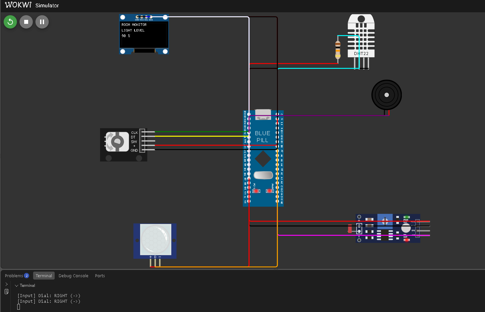
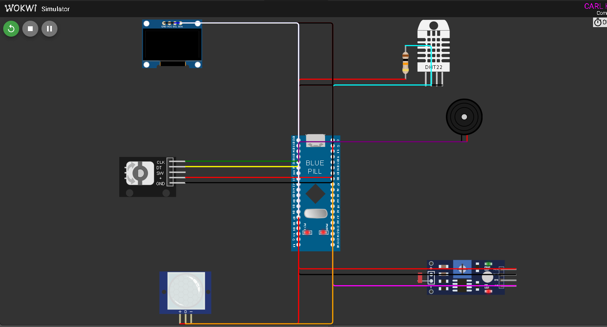
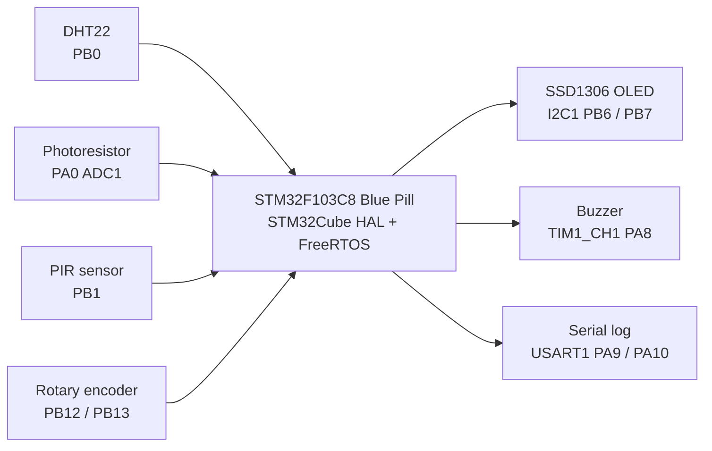
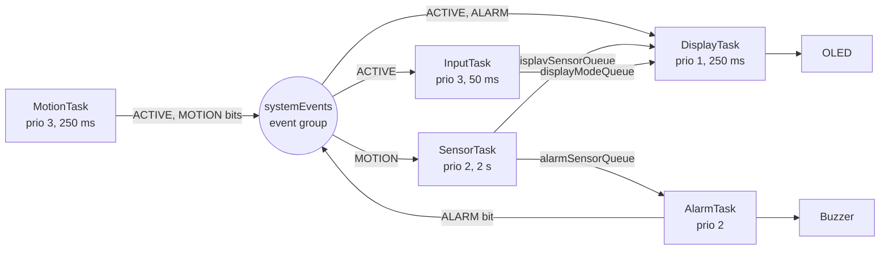
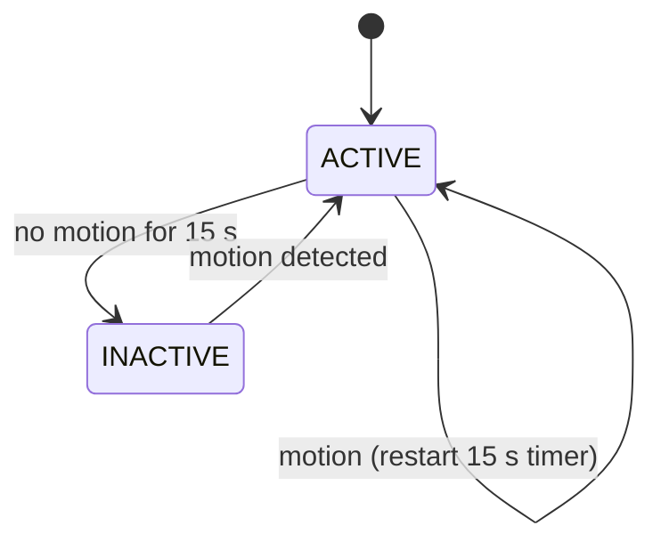

# BCA182 FreeRTOS Multisensor Room Monitor

Carl Hovan B. Chan, B187. BCA182 Embedded Systems Programming, Laboratory Activity No. 1, MSU-IIT.

Lab report: [docs/laboratory-report.pdf](docs/laboratory-report.pdf)

## Project Overview

A room monitor on an STM32F103C8 Blue Pill, simulated in Wokwi. It reads temperature, humidity, light and motion, shows one reading at a time on an OLED, turns on a buzzer when the temperature is out of range, and turns the OLED off when nobody is around. Built with PlatformIO, the STM32Cube HAL and native FreeRTOS in C++.



## Features

- Temperature and humidity from a DHT22 every 2 s
- Relative light level (0-100 %) from a photoresistor through the ADC
- Motion detection with a PIR sensor
- SSD1306 OLED showing one page at a time
- Rotary encoder to change pages (Temperature, Humidity, Light, Motion), both directions with wraparound
- Buzzer alarm below 18 °C or above 30 °C
- ACTIVE / INACTIVE state: after 15 s with no motion the OLED turns off, motion turns it back on
- 5 FreeRTOS tasks, 3 queues, 1 event group, 1 mutex, `vTaskDelayUntil()` for periodic sampling
- 15 unit tests and `pio check` static analysis

## Learning Objectives

- Split an embedded program into FreeRTOS tasks with justified priorities
- Use queues, an event group and a mutex instead of shared globals
- Use `vTaskDelayUntil()` for drift-free periodic work
- Implement a state machine
- Test logic with unit tests and check code with static analysis
- Observe scheduling problems through fault experiments

## System Architecture





The code is split into drivers (`hardware.cpp`, `ssd1306.cpp`, `serial_log.cpp`), task files (`sensors.cpp`, `display.cpp`, `input.cpp`, `alarm.cpp`, `motion.cpp`) and hardware-independent logic (`alarm_logic.cpp`, `display_navigation.cpp`, `sensor_values.cpp`, `system_state.cpp`) that is unit tested on the PC.

## FreeRTOS Architecture



All tasks print through `Serial_Print()`, which takes `serialMutex` so messages on USART1 don't mix.

FreeRTOS V10.3.1 runs with a 20 Hz tick. The standard Cortex-M3 port does not run in Wokwi, so this project uses the Wokwi-compatible port by classmate Ni-ear (TIM3 tick, task switching without SysTick/SVC/PendSV). See References and Acknowledgments.

## Hardware / Simulated Components

| Component | Wokwi part | Use |
|---|---|---|
| STM32F103C8 Blue Pill | board-stm32-bluepill | Microcontroller |
| DHT22 + 10 kΩ pull-up | wokwi-dht22 | Temperature and humidity |
| Photoresistor module | wokwi-photoresistor-sensor | Light level |
| PIR sensor | wokwi-pir-motion-sensor | Motion |
| KY-040 rotary encoder | wokwi-ky-040 | Page navigation |
| SSD1306 128x64 OLED | board-ssd1306 | Display |
| Buzzer | wokwi-buzzer | Temperature alarm |

## Pin Configuration

| Signal | Pin | Mode |
|---|---|---|
| DHT22 data | PB0 | Open-drain start pulse, then input with pull-up (timed by TIM4 at 1 MHz) |
| Photoresistor AO | PA0 | ADC1 channel 0 |
| PIR OUT | PB1 | Digital input |
| Encoder CLK / DT | PB12 / PB13 | Inputs with pull-up, polled |
| OLED SCL / SDA | PB6 / PB7 | I2C1, 400 kHz |
| Buzzer | PA8 | TIM1 CH1 PWM, 1 kHz |
| Serial TX / RX | PA9 / PA10 | USART1, about 115200 baud |

Timers: TIM1 buzzer PWM, TIM2 HAL time base, TIM3 FreeRTOS tick, TIM4 DHT22 timing.

## Task Design

| Task | Job | Period / trigger | Priority | Stack (words) |
|---|---|---|---|---|
| MotionTask | Read PIR, track 15 s timeout, run the state machine | 250 ms (`vTaskDelayUntil`) | 3 | 192 |
| InputTask | Read encoder, change page | 50 ms | 3 | 128 |
| SensorTask | Read DHT22 and photoresistor | 2 s (`vTaskDelayUntil`) | 2 | 256 |
| AlarmTask | Check temperature, drive buzzer | Each new reading | 2 | 192 |
| DisplayTask | Draw the OLED (only task that uses it) | 250 ms | 1 | 256 |

MotionTask and InputTask react to the user, so they have the highest priority. They do little work and block often, so they don't starve other tasks. Sensor and alarm work run on a 2 s cycle, where a small delay doesn't matter. The OLED is slow over I2C and least urgent, so DisplayTask is lowest.

## Inter-Task Communication

| Object | Type | From → To | Data |
|---|---|---|---|
| `displaySensorQueue` | Queue (length 1, overwrite) | SensorTask → DisplayTask | `SensorData` |
| `alarmSensorQueue` | Queue (length 1, overwrite) | SensorTask → AlarmTask | `SensorData` |
| `displayModeQueue` | Queue (length 1, overwrite) | InputTask → DisplayTask | `DisplayMode` |
| `systemEvents` BIT0 `EVENT_ACTIVE` | Event group | MotionTask → DisplayTask, InputTask | System is ACTIVE |
| `systemEvents` BIT1 `EVENT_MOTION` | Event group | MotionTask → SensorTask | PIR is high |
| `systemEvents` BIT2 `EVENT_ALARM` | Event group | AlarmTask → DisplayTask | Alarm is on |
| `serialMutex` | Mutex | All tasks | Protects USART1 |

Two sensor queues are used because a queue item is removed by whichever task reads it first.

## State Machine



ACTIVE: OLED on, encoder works. INACTIVE: OLED cleared and turned off, encoder ignored. The PIR is still read so motion can wake the system. The logic is in `UpdateSystemState()` (`system_state.cpp`), called by MotionTask.

## Repository Structure

```text
include/       Headers and FreeRTOSConfig.h
lib/FreeRTOS/  FreeRTOS kernel and Wokwi-compatible ARM_CM3 port
src/           Tasks, drivers and logic
test/          Unity unit tests (native)
docs/          Lab report, notes and images
diagram.json   Wokwi circuit
platformio.ini PlatformIO environments
wokwi.toml     Wokwi firmware paths
STM32F103xx_FLASH.ld  Linker script
```

## Getting Started

Needs VS Code, the PlatformIO extension and the Wokwi Simulator extension (with a Wokwi license).

1. Clone the repository and open the folder in VS Code.
2. Build the firmware.
3. Start the Wokwi simulator.

## Building the Project

```bash
pio run -e bluepill_f103c8
```

The `native` environment is only for unit tests.

## Running the Wokwi Simulation

After building, open `diagram.json` and start the simulator (F1 → "Wokwi: Start Simulator"). Change the DHT22 and photoresistor values by clicking them, press "Simulate motion" on the PIR, and turn the encoder with its arrows. The serial monitor shows task logs such as:

```text
[SensorTask] T=28.0 C H=61.2 % Light=75 % Motion=NO DHT=OK
[Alarm] HIGH TEMPERATURE
[Motion] INACTIVE: timeout
```

## Unit Testing

```bash
pio test -e native
```

15 tests, all passing: alarm limits (below, exactly 18 °C, inside, exactly 30 °C, above), light conversion (minimum and maximum ADC), page navigation both directions with wraparound, and all four ACTIVE/INACTIVE cases.

## Static Code Analysis

```bash
pio check -e bluepill_f103c8
```

No high or medium findings. A duplicate condition in `display.cpp` was fixed and the unused `Hardware_VectorTableOk()` was removed. The remaining low findings (unused functions called through FreeRTOS or the vector table, const pointer notes in HAL callbacks, C-style casts in register macros) were reviewed and kept. Details in [docs/part-xv-static-analysis.md](docs/part-xv-static-analysis.md).

## Functional Verification

All 10 Wokwi tests (FT-01 to FT-10) passed: temperature, humidity and light updates, encoder both directions, alarm on above 30 °C and off when back to normal, staying ACTIVE on motion, INACTIVE after 15 s, and waking on motion. Fault experiments (no blocking delay, higher priority, no mutex) are in the lab report and [docs/part-xvii-fault-experiments.md](docs/part-xvii-fault-experiments.md).

## Engineering Decisions

- Wokwi-compatible FreeRTOS port, because the standard port doesn't run in the simulator.
- MotionTask runs the state machine instead of a separate StateTask.
- Encoder and PIR are polled instead of using interrupts. This is simpler and fast enough here.
- Length-1 queues with `xQueueOverwrite` so readers always get the newest value.
- Buzzer on its own timer (TIM1 PA8) after PB10/TIM2 stayed silent because TIM2 is the HAL time base.
- Logic kept in hardware-free files so it can be unit tested.

## Limitations

- The FreeRTOS port only works in Wokwi. A real Blue Pill should use the standard ARM_CM3 port.
- The 20 Hz tick gives 50 ms timing resolution.
- The light value is relative, not calibrated lux.
- The 15 s timeout is short for testing.
- Only tested in simulation.

## Future Improvements

- Test on a real Blue Pill
- Use EXTI interrupts for the encoder and PIR
- Calibrate the light sensor
- Beeping alarm pattern and more status on the OLED

## References and Acknowledgments

- BCA182 Laboratory Activity No. 1, Asst. Prof. Paul Rodolf P. Castor, MSU-IIT
- FreeRTOS Kernel V10.3.1 (MIT license): https://github.com/FreeRTOS/FreeRTOS-Kernel
- **Shaqkobe Dos Tejada "Ni-ear" (classmate):** Wokwi-compatible FreeRTOS port, linker script and hardware start-up approach, https://github.com/Ni-ear/bca182-freertos-multisensor
- **Shanice Reih Tanque (classmate):** For invaluable assistance in troubleshooting the issue with the buzzer not working.
- STMicroelectronics STM32CubeF1 HAL and CMSIS
- PlatformIO, Unity and cppcheck
- Wokwi: https://docs.wokwi.com
- AI tools were used as an assistant for debugging and documentation.